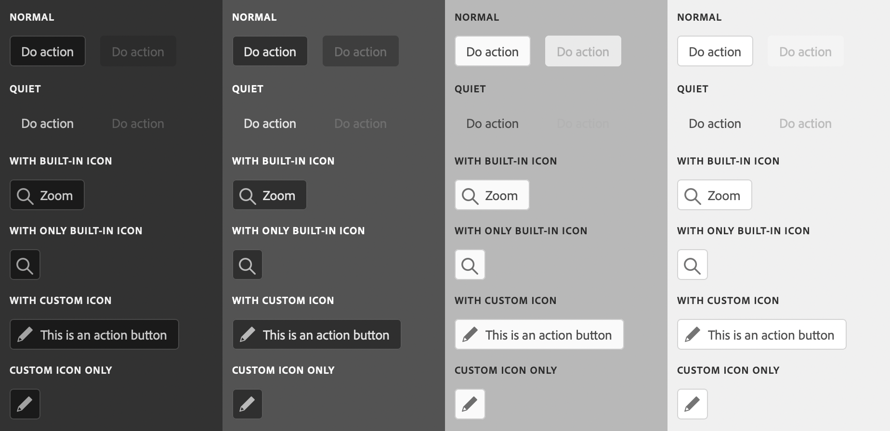

# sp-action-button

**Since:** UXP v4.1

Renders an action button.



**See**:
- https://spectrum.adobe.com/page/action-button/
- https://opensource.adobe.com/spectrum-web-components/components/action-button

**Example**

```html
<sp-action-button>An Action</sp-action-button>
```

## Variants

There are several variations that are supported.

### Disabled

```html
<sp-action-button disabled>Disabled</sp-action-button>
```

### Quiet

```html
<sp-action-button quiet>A quiet button</sp-action-button>
```

### With icon

#### Built-in SVG icon

```html
<sp-action-button>
    <sp-icon name="ui:Magnifier" size="xs" slot="icon"></sp-icon>
    Zoom
</sp-action-button>
```

#### Custom SVG icon
```html
<sp-action-button>
    <div slot="icon" style="fill: currentColor">
        <svg viewBox="0 0 36 36" style="width: 18px; height: 18px;">
            <path d="M33.567 8.2L27.8 2.432a1.215 1.215 0 0 0-.866-.353H26.9a1.371 1.371 0 0 0-.927.406L5.084 23.372a.99.99 0 0 0-.251.422L2.055 33.1c-.114.377.459.851.783.851a.251.251 0 0 0 .062-.007c.276-.063 7.866-2.344 9.311-2.778a.972.972 0 0 0 .414-.249l20.888-20.889a1.372 1.372 0 0 0 .4-.883 1.221 1.221 0 0 0-.346-.945zM11.4 29.316c-2.161.649-4.862 1.465-6.729 2.022l2.009-6.73z"/>
        </svg>
    </div>
    Edit Text
</sp-action-button>
```

### Icon only

#### Built-in SVG icon

```html
<sp-action-button style="padding: 0; max-width: 32px; max-height: 32px;">
    <sp-icon name="ui:Magnifier" size="s" slot="icon"></sp-icon>
</sp-action-button>
```

#### Custom SVG icon

```html
<sp-action-button style="padding: 0; max-width: 32px; max-height: 32px;">
    <div slot="icon" style="fill: currentColor">
        <svg viewBox="0 0 36 36" style="width: 18px; height: 18px;">
            <path d="M33.567 8.2L27.8 2.432a1.215 1.215 0 0 0-.866-.353H26.9a1.371 1.371 0 0 0-.927.406L5.084 23.372a.99.99 0 0 0-.251.422L2.055 33.1c-.114.377.459.851.783.851a.251.251 0 0 0 .062-.007c.276-.063 7.866-2.344 9.311-2.778a.972.972 0 0 0 .414-.249l20.888-20.889a1.372 1.372 0 0 0 .4-.883 1.221 1.221 0 0 0-.346-.945zM11.4 29.316c-2.161.649-4.862 1.465-6.729 2.022l2.009-6.73z"/>
        </svg>
    </div>
</sp-action-button>
```

## Responding to events

You can respond to a click on the action button using the `click` event.

```js
document.querySelector(".yourActionButton").addEventListener("click", evt => {
    console.log("Action Button clicked");
})
```
