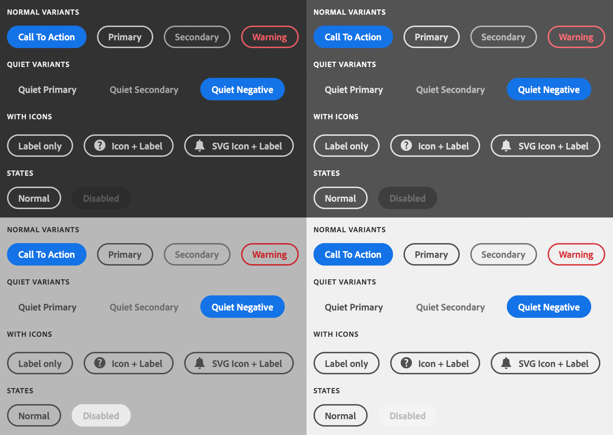

# sp-button

**Since:** UXP v4.1

Renders a button.



**See**:
- https://spectrum.adobe.com/page/button/
- https://opensource.adobe.com/spectrum-web-components/components/button

**Example**

```html
<sp-button>Vectorize</sp-button>
```

## Variants

There are several variations that are supported.

### Call to action

Renders a "call to action"-style button. This is the default variant if no variant is provided.

```html
<sp-button variant="cta">Click me</sp-button>
```

### Primary

Renders a "primary" button.

```html
<sp-button variant="primary">Click me</sp-button>
```

### Secondary

Renders a "secondary" button.

```html
<sp-button variant="secondary">Click me</sp-button>
```

### Warning

Renders a button intended to be used to indicate negative consequences to the action, such as an action that can't be undone.

<InlineAlert variant="warning" slots="text"/>

Spectrum Web Components now uses a `negative` variant. This will be addressed in a future update.

```html
<sp-button variant="warning">Click me</sp-button>
```

### Over Background

Renders a button that's suitable over a background (such as an image).

```html
<sp-button variant="overBackground">Over an Image</sp-button>
```

### Disabled

```html
<sp-button disabled>Disabled</sp-button>
```

### Quiet

Quiet buttons do not have a border, and are less visually distracting.

<InlineAlert variant="warning" slots="text"/>

Quiet buttons do not support the `cta` variant.

```html
<sp-button quiet>A quiet button</sp-button>
```

### With icon

#### Built-in SVG icon

```html
<sp-button>
    <sp-icon name="ui:Magnifier" size="s" slot="icon"></sp-icon>
    Zoom
</sp-button>
```

#### Custom SVG icon
```html
<sp-button>
    <div slot="icon" style="fill: currentColor">
        <svg viewBox="0 0 36 36" style="width: 18px; height: 18px;">
            <path d="M33.567 8.2L27.8 2.432a1.215 1.215 0 0 0-.866-.353H26.9a1.371 1.371 0 0 0-.927.406L5.084 23.372a.99.99 0 0 0-.251.422L2.055 33.1c-.114.377.459.851.783.851a.251.251 0 0 0 .062-.007c.276-.063 7.866-2.344 9.311-2.778a.972.972 0 0 0 .414-.249l20.888-20.889a1.372 1.372 0 0 0 .4-.883 1.221 1.221 0 0 0-.346-.945zM11.4 29.316c-2.161.649-4.862 1.465-6.729 2.022l2.009-6.73z"/>
        </svg>
    </div>
    Edit Text
</sp-button>
```

## Responding to events

You can respond to a click on the button using the `click` event.

```js
document.querySelector(".yourButton").addEventListener("click", evt => {
    console.log("Button clicked");
})
```
