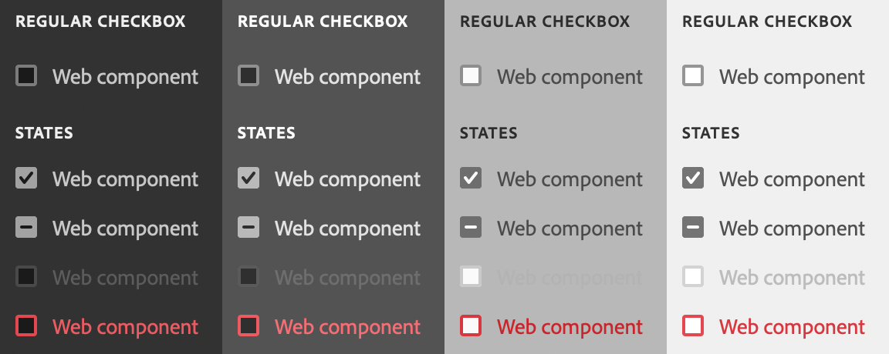

# sp-checkbox

**Since:** UXP v4.1

Renders a checkbox with associated label.



**See**:
- https://spectrum.adobe.com/page/checkbox/
- https://opensource.adobe.com/spectrum-web-components/components/checkbox

**Example**

```html
<sp-checkbox>Include all metadata</sp-checkbox>
```

## States

There are several states that are supported.

### Checked

```html
<sp-checkbox checked>Checked</sp-checkbox>
```

### Indeterminate

```html
<sp-checkbox indeterminate>Indeterminate</sp-checkbox>
```

### Disabled

```html
<sp-checkbox disabled>Disabled</sp-checkbox>
```

### Invalid

```html
<sp-checkbox invalid>Invalid</sp-checkbox>
```

## Responding to events

You can respond to changes in the checkbox using the `change` or `input` events.

```js
document.querySelector(".yourCheckbox").addEventListener("change", evt => {
    console.log(`Is the checkbox checked: ${evt.target.checked}`);
})
```

