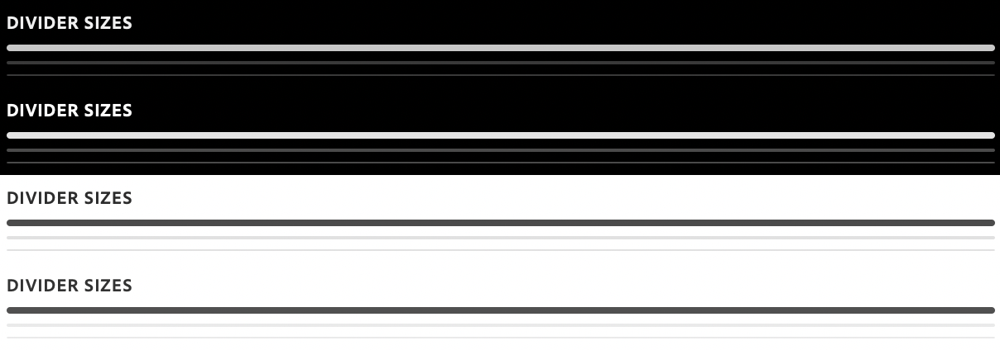

# sp-divider

**Since:** UXP v4.1

Renders a divider.



**See**:
- https://spectrum.adobe.com/page/rule/
- https://opensource.adobe.com/spectrum-web-components/components/rule

**Example**

```html
<sp-divider></sp-divider>
```

## Sizes

There are three supported sizes.

```html
<sp-divider size="large"></sp-divider>
<sp-divider size="medium"></sp-divider> <!-- default -->
<sp-divider size="small"></sp-divider>
```
