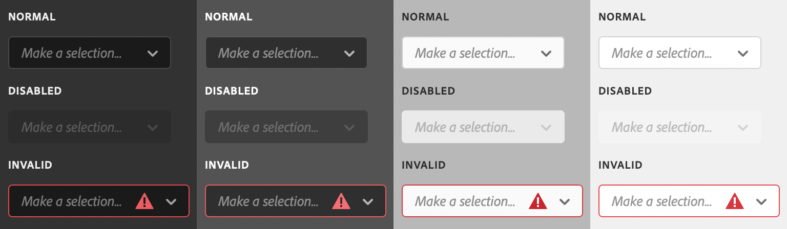

# sp-dropdown

**Since:** UXP v4.1

Renders a dropdown with menu items. The dropdown must contain a [sp-menu](/uxp-api/reference-spectrum/User%20Interface/sp-menu/) with `slot="options"`, and inside the `sp-menu`, a series of `sp-menu-item` or `sp-menu-divider` elements.



**See**:
- https://spectrum.adobe.com/page/picker/
- https://opensource.adobe.com/spectrum-web-components/components/dropdown

**Example**

```html
<sp-dropdown placeholder="Make a selection..." style="width: 320px">
    <sp-menu slot="options">
        <sp-menu-item> Deselect </sp-menu-item>
        <sp-menu-item> Select inverse </sp-menu-item>
        <sp-menu-item> Feather... </sp-menu-item>
        <sp-menu-item> Select and mask... </sp-menu-item>
        <sp-menu-divider></sp-menu-divider>
        <sp-menu-item> Save selection </sp-menu-item>
        <sp-menu-item disabled> Make work path </sp-menu-item>
    </sp-menu>
</sp-dropdown>
```

## Variations

Dropdowns come in several different variations.

### Quiet

```html
<sp-dropdown quiet>...</sp-dropdown>
```

### Disabled

```html
<sp-dropdown disabled>...</sp-dropdown>
```

### Invalid

```html
<sp-dropdown invalid>...</sp-dropdown>
```

## Responding to events

You can respond to changes in the dropdown using the `change` event.

```js
document.querySelector(".yourDropdown").addEventListener("change", evt => {
    console.log(`Selected item: ${evt.target.selectedIndex}`);
})
```

