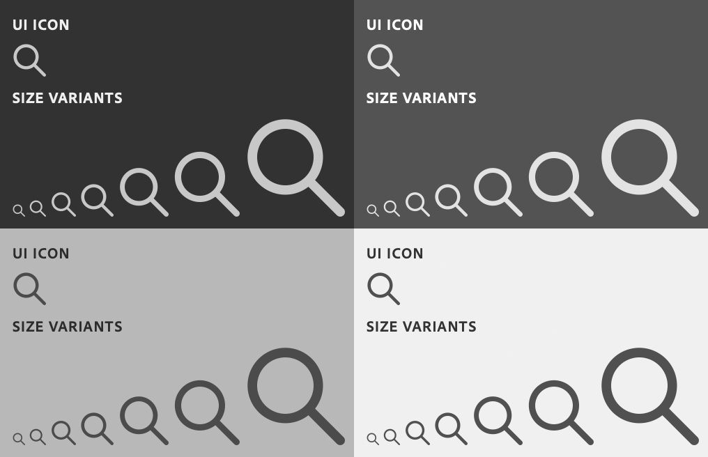

# sp-icon

**Since:** UXP v4.1

Display a named icon.



**See**:
- https://spectrum.adobe.com/page/icons/
- https://opensource.adobe.com/spectrum-web-components/components/icon

**Example**

```html
<sp-icon name="ui:Magnifier"></sp-icon>
```

## Sizes

Icons can be rendered in various sizes by specifying a T-Shirt size with a `size` attribute.

```html
<sp-icon size="xxs" name="ui:Magnifier"></sp-icon>
<sp-icon size="xs" name="ui:Magnifier"></sp-icon>
<sp-icon size="s" name="ui:Magnifier"></sp-icon>
<sp-icon size="m" name="ui:Magnifier"></sp-icon>
<sp-icon size="l" name="ui:Magnifier"></sp-icon>
<sp-icon size="xl" name="ui:Magnifier"></sp-icon>
<sp-icon size="xxl" name="ui:Magnifier"></sp-icon>
```

## Built-in Icons

Spectrum UXP supplies the [Spectrum UI icons](https://spectrum.adobe.com/page/icons/). They are named as follows:

* AlertMedium
* AlertSmall
* ArrowDownSmall
* ArrowLeftMedium
* ArrowUpSmall
* Asterisk
* CheckmarkMedium
* CheckmarkSmall
* ChevronDownMedium
* ChevronDownSmall
* ChevronLeftLarge
* ChevronLeftMedium
* ChevronRightLarge
* ChevronRightMedium
* ChevronRightSmall
* ChevronUpSmall
* CornerTriangle
* CrossLarge
* CrossMedium
* CrossSmall
* DashSmall
* DoubleGripper
* FolderBreadcrumb
* HelpMedium
* HelpSmall
* InfoMedium
* InfoSmall
* Magnifier
* More
* SkipLeft
* SkipRight
* Star
* StarOutline
* SuccessMedium
* SuccessSmall
* TripleGripper
