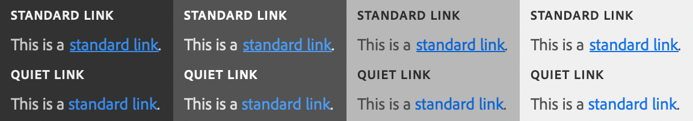

# sp-link

**Since:** UXP v4.1

Renders a link, that when clicked can launch a webpage in the user's default browser.



**See**:
- https://spectrum.adobe.com/page/link/
- https://opensource.adobe.com/spectrum-web-components/components/link

**Example**

```html
<sp-link href="https://adobe.com">Adobe</sp-link>
```

## Variations

### Over Background

```html
<sp-link variant="overBackground">This link has more contrast, suitable for rendering over a colored background.</sp-link>
```

### Quiet

```html
<sp-link quiet>This is a quiet link</sp-link>
```

## Responding to events

You can respond to a click on the link using the `click` event. However, you cannot prevent the navigation to the URL specified by `href`. If the `href` attribute is not specified, no browser will be launched.

```js
document.querySelector(".yourLink").addEventListener("click", evt => {
    console.log("You clicked a link");
})
```

