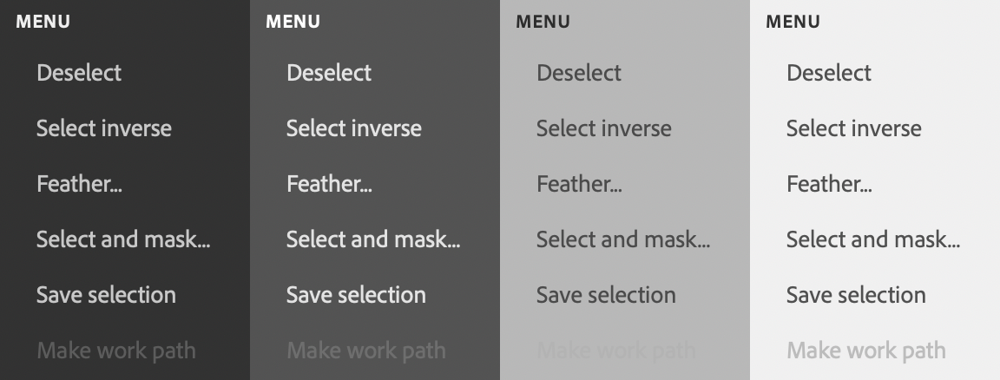

# sp-menu-item

**Since:** UXP v4.1

Renders a menu item, with an optional checkmark indicating selection.



**See**:
- https://opensource.adobe.com/spectrum-web-components/components/menu

**Example**

```html
<sp-menu-item>Chicago</sp-menu-item>
<sp-menu-item selected>New York City</sp-menu-item>
<sp-menu-item disabled>St. Louis</sp-menu-item>
```

## Responding to events

You can respond to a click on the menu item using the `click` event. 

```js
document.querySelector(".yourMenuItem").addEventListener("click", evt => {
    console.log("You clicked a menu item");
    evt.target.selected = !evt.target.selected;
}):
```

