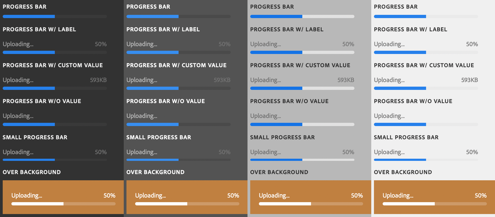

# sp-progressbar

**Since:** UXP v4.1

Renders a progress bar.



**See**:
- https://spectrum.adobe.com/page/progress-bar/

**Example**

```html
<sp-detail>PROGRESS BAR</sp-detail>
<sp-progressbar max=100 value=50></sp-progressbar>
<br/><sp-detail>PROGRESS BAR W/ LABEL</sp-detail>
<sp-progressbar max=100 value=50>
    <sp-label slot="label">Uploading...</sp-label>
</sp-progressbar>
<br/><sp-detail>PROGRESS BAR W/ CUSTOM VALUE</sp-detail>
<sp-progressbar max=100 value=50 value-label="593KB">
    <sp-label slot="label">Uploading...</sp-label>
</sp-progressbar>
<br/><sp-detail>PROGRESS BAR W/O VALUE</sp-detail>
<sp-progressbar max=100 value=50 show-value="false">
    <sp-label slot="label">Uploading...</sp-label>
</sp-progressbar>
<br/><sp-detail>SMALL PROGRESS BAR</sp-detail>
<sp-progressbar max=100 value=50 size="small">
    <sp-label slot="label">Uploading...</sp-label>
</sp-progressbar>
<br/><sp-detail>OVER BACKGROUND</sp-detail>
<div style="background-color:#C08040; padding: 16px">
    <sp-progressbar variant="overBackground" max=100 value=50>
        <sp-label slot="label">Uploading...</sp-label>
    </sp-progressbar>
</div>
```
