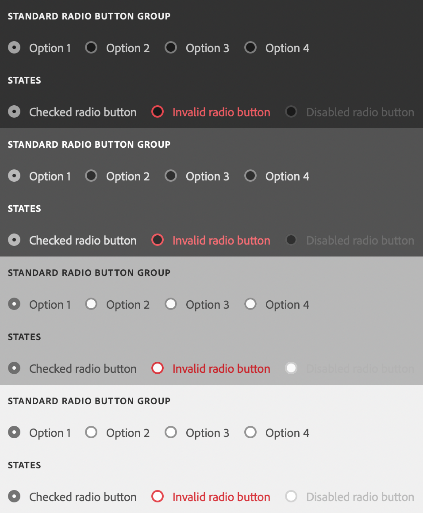

# sp-radio-group

**Since:** UXP v4.1

Renders a group of radio buttons horizontally or vertically (column layout), with an optional field label.



**See**:
- https://spectrum.adobe.com/page/radio-button/
- https://opensource.adobe.com/spectrum-web-components/components/radio

**Example**

```html
<sp-radio-group>
    <sp-label slot="label">Select a product:</sp-label>
    <sp-radio value="ps">Adobe Photoshop</sp-radio>
    <sp-radio value="xd">Adobe XD</sp-radio>
</sp-radio-group>
```

## Layout

By default, radio groups are laid out horizontally. If you add the `column` attribute, the radio group will be laid out vertically.

```html
<sp-radio-group column>
    <sp-radio value="ps">Adobe Photoshop</sp-radio>
    <sp-radio value="xd">Adobe XD</sp-radio>
</sp-radio-group>
```

## Responding to events

You can respond to changes in the radio group using the `change` event.

```js
document.querySelector(".yourRadioGroup").addEventListener("change", evt => {
    console.log(`Selected item: ${evt.target.value}`);
})
```

