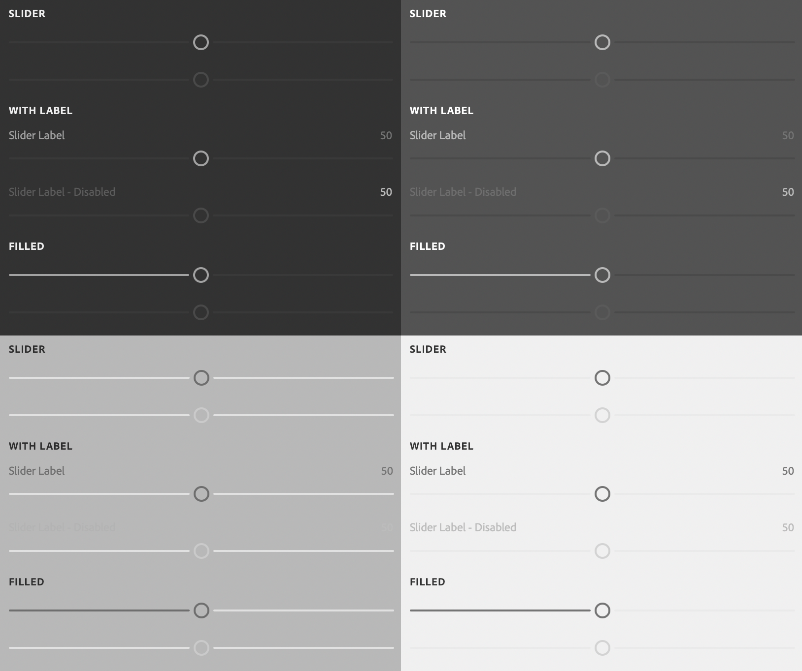

# sp-slider

**Since:** UXP v4.1

Renders a slider with optional associated label.



**See**:
- https://spectrum.adobe.com/page/slider/
- https://opensource.adobe.com/spectrum-web-components/components/slider

**Example**

```html
<sp-slider min="0" max="100" value="50">
    <sp-label slot="label">Slider Label</sp-label>
</sp-slider>
```

## Variants and states

There are several different variants for sliders.

### Disabled

Indicates that the slider is disabled.

```html
<sp-slider disabled min="0" max="100" value="50"></sp-slider>
```

### Filled

Fills one side of the slider track. Which side is specified with `fill-offset`.

```html
<sp-slider variant="filled" fill-offset="left" min="0" max="100" value="50"></sp-slider>
<sp-slider variant="filled" fill-offset="right" min="0" max="100" value="50"></sp-slider>
```

### Custom unit

You can specify a custom unit for the slider value -- such as "%".

```html
<sp-slider value-label="%" min="0" max="100" value="50"></sp-slider>
```

### Hiding the value

You can hide the slider value.

```html
<sp-slider show-value="false" min="0" max="100" value="50"></sp-slider>
```

## Responding to events

You can respond to changes on the slider using the `change` and `input` events.

```js
document.querySelector(".yourSlider").addEventListener("input", evt => {
    console.log(`New value: ${evt.target.value}`);
})
```

