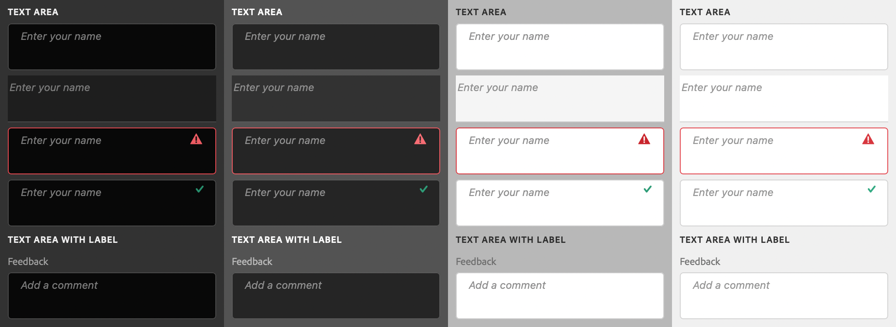

# sp-textarea

**Since:** UXP v4.1

Renders a text area with optional associated label.



**See**:
- https://spectrum.adobe.com/page/text-area/
- https://opensource.adobe.com/spectrum-web-components/components/textarea

**Example**

```html
<sp-textarea placeholder="Enter your name">
    <sp-label slot="label">Name</sp-label>
</sp-textarea>
```

## Variants and states

There are several different variants for text areas.

### Disabled

Indicates that the text area is disabled.

```html
<sp-textarea disabled placeholder="Enter your name"></sp-textarea>
```

### Valid

Indicates that the value of the text area is valid.

```html
<sp-textarea valid placeholder="Enter your name"></sp-textarea>
```

### Invalid

Indicates that the value of the text area is invalid.

```html
<sp-textarea invalid placeholder="Enter your name"></sp-textarea>
```

### Quiet

Styles the text area in a quieter, simpler appearance.

```html
<sp-textarea quiet placeholder="Enter your name"></sp-textarea>
```

## Responding to events

You can respond to changes on the text area using the `change` and `input` events.

```js
document.querySelector(".yourTextArea").addEventListener("input", evt => {
    console.log(`New value: ${evt.target.value}`);
})
```

