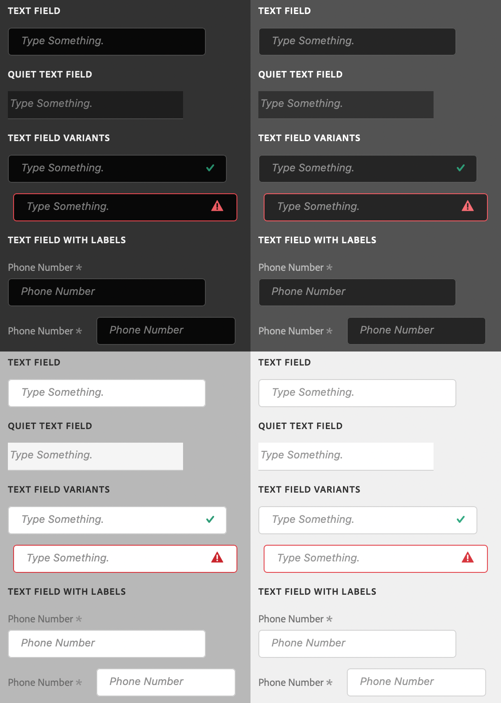

# sp-textfield

**Since:** UXP v4.1

Renders a text field with optional associated label.



**See**:
- https://spectrum.adobe.com/page/text-field/
- https://opensource.adobe.com/spectrum-web-components/components/textfield

**Example**

```html
<sp-textfield placeholder="Phone Number">
    <sp-label isrequired="true" slot="label">Phone Number</sp-label>
</sp-textfield>
```

## Variants and states

There are several different variants for text fields.

### Disabled

Indicates that the text field is disabled.

```html
<sp-textfield disabled placeholder="Phone Number"><sp-textfield>
```

### Valid

Indicates that the value of the text field is valid.

```html
<sp-textfield valid placeholder="Phone Number"><sp-textfield>
```

### Invalid

Indicates that the value of the text field is invalid.

```html
<sp-textfield invalid placeholder="Phone Number"><sp-textfield>
```

### Quiet

Styles the text field in a quieter, simpler appearance.

```html
<sp-textfield quiet placeholder="Phone Number"><sp-textfield>
```

### Numeric fields

Restricts the text field to numeric data. You cannot currently specify minimum, maximum, or steps. The numeric value must be between -214,748.36 and 214,748.36, or an error will be displayed and the value capped to the nearest acceptable value.

```html
<sp-textfield type="number" placeholder="Age"><sp-textfield>
```

### Search fields

Adds a search icon to indicate that the text will be used for searching.

```html
<sp-textfield type="search" placeholder="Age"><sp-textfield>
```

### Password fields

Styles the entered text in a way that it is not visible what is being typed.

```html
<sp-textfield type="password" placeholder="Age"><sp-textfield>
```

<InlineAlert variant="warning" slots="text"/>

The password field's `value` cannot be read on macOS. This is a bug and will be fixed in the future. You can work around this by switching the `type` to `text` on `focus`, and then switching the `type` back to `password` on `blur`.


## Responding to events

You can respond to changes on the text area using the `change` and `input` events.

```js
document.querySelector(".yourTextField").addEventListener("input", evt => {
    console.log(`New value: ${evt.target.value}`);
})
```

