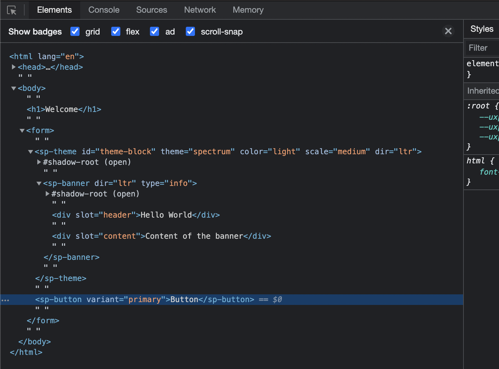
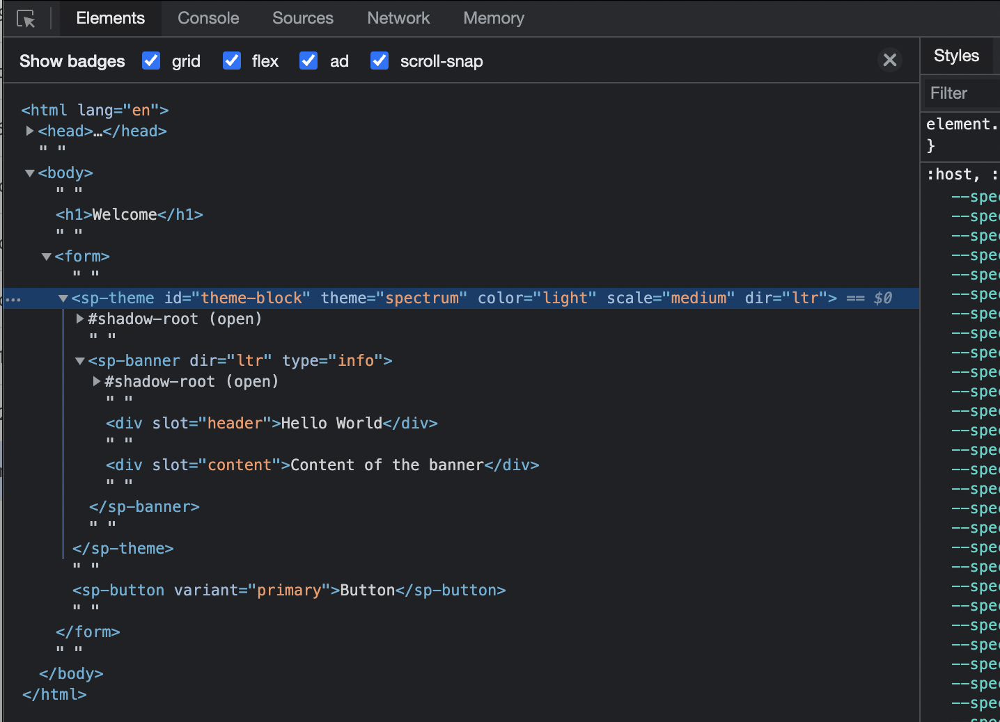

---
keywords:
  - Spectrum UXP Reference
  - Spectrum Web Components
  - SWC
  - Web Components
  - Spectrum differences
  - Spectrum in UXP
title: Adobe Spectrum UXP Reference
description: Describes the Spectrum-related UI options available within UXP 
contributors:
  - https://github.com/padmkris123
---

# Spectrum UXP Reference


UXP supports the UI to be written in three ways using standard HTML Elements, built-in Spectrum UXP widgets, and Spectrum Web Components (recently added)


But before we proceed, it's important to understand some terminology
- Spectrum - An open-source design language and guidelines provided by Adobe.
- Web components - HTML5 Web technology lets you define custom HTML tags.
- Adobe Spectrum Web Components (popularly known as SWC) - An open-source library that has Spectrum-styled web components.


With that in mind, let's get into the details:
- HTML elements
   These are pure HTML elements following the web standards. For example, ``, `<dialog>` etc. You have the flexibility to style them with your custom stylesheet.


Checkout the list of supported HTML [tags](../reference-html/) and [elements](../reference-js/Global%20Members/HTML%20Elements/).
  
- Spectrum UXP widgets
   These are built-in Spectrum-styled UXP components. These widgets mimic the Adobe SWC library APIs and expose a subset of the functionality of the corresponding SWC. 

   You can use them as you would any other HTML tag. For example,
   
   ```html
   <sp-button variant="primary">I'm a Spectrum button</sp-button>
   ```

   Take a look at the list of UXP-supported Spectrum widgets - [User Interface](./Spectrum%20UXP%20Widgets/User%20Interface/) and [Typography](./Spectrum%20UXP%20Widgets/Typography/)


- UXP Spectrum web components (Beta)
   These are the Adobe Spectrum Web Components, now supported by UXP v7.0 onwards. It's built using Web Components technology.


   In order to use them, you require to install the components individually and then `import` them before using the component tag. For example,
  
   ```
   npm i @spectrum-web-components/button@0.19.8
   ```
  
   ```js
   import '@spectrum-web-components/button/sp-button.js';
   ```


   ```html
   <sp-button variant="primary">I'm a SWC button</sp-button>
   ```
  Note that although the tag appears to be identical to Spectrum UXP widgets, the way they are implemented is fundamentally different. Read on to learn more about the differences.


## Differences

Now that you know the various options, you must understand their differences and limitations


- HTML elements
   Keep in mind that UXP is not a browser. It's a platform that provides the ease of using web technologies to build plugins/scripts for desktop applications. Hence, it does not support all the HTML/CSS capabilities you can use in a browser. In fact, the tags that are _not_ supported are treated like simple `<div>`.

   Do take a look at the list of HTML [elements](../reference-html/General/Unsupported%20Elements/), and [attributes](../reference-html/General/Unsupported%20Attributes/) that are _not_ supported.
  
- Spectrum UXP widgets
   Remember that these are built-in within UXP. Therefore, they may appear to be a black-box solution that does not allow you to peek into the details or alter their behavior easily.

   


- UXP Spectrum web components (Beta)
   Since this is in the beta phase and we are working on supporting more components in the future, you may not find all the components you need. 
  
   Moreover, these components follow the principles of SWC and web components, which means
   1. You need to `import` individual comps before using them
   2. You can debug SWC like a regular Web Component. 
      


That said, you can mix and match these three offerings to suit your use case. For example, the following will work seamlessly


```HTML
<form> <!-- plain HTML element -->
   <sp-banner> <!-- Spectrum Web Component -->
     <div slot="header">Header text</div>
     <div slot="content">Content of the banner</div>
  </sp-banner>
  <sp-button variant="primary">I'm a button</sp-button> <!-- Spectrum widget -->
</form>
```

## What's best for you?


The choice you make depends on your use case and the stage of development you are in.


If you are looking for a ready-made Adobe Spectrum-styled UI or are just getting started with programming your UI, we recommend you start your journey with SWC. Fall back to Spectrum UXP widgets for the comps that are not available yet. And use plain HTML elements when they are not available in either.


However, if you prefer vanilla HTML and don't mind undertaking the efforts of styling, use the HTML elements along with your custom stylesheet. In fact, you can build your own custom tags using Web Components.


If you are thinking of upgrading your existing UI, you should check out the new components in SWC that are not available with Spectrum UXP widgets. Migrating your existing UI to SWC is very easy. Use the [sample plugin](link to sample plugin) to get started.


Visit the following topics to learn about them in detail
- [Spectrum Web Components](swc/index.md)
- [Spectrum UXP widgets](Spectrum%20UXP%20Widgets/index.md)
